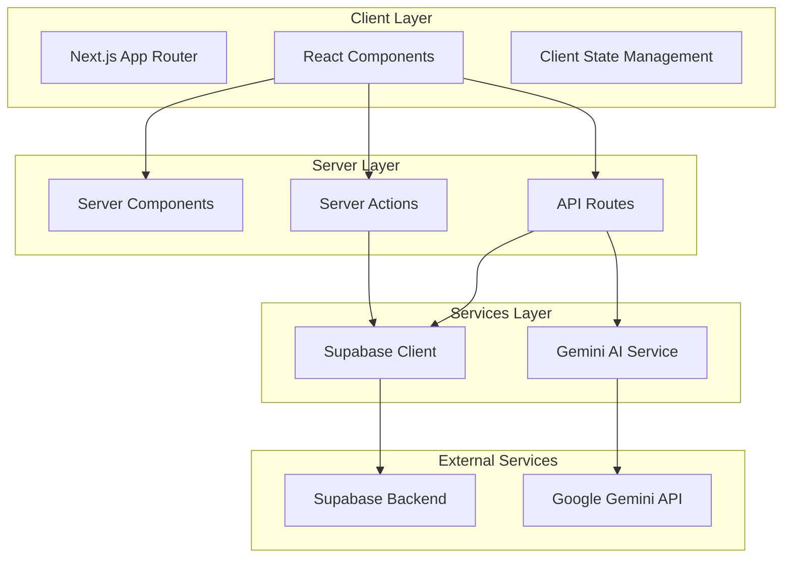

# Design Document

## Overview

Inkflow is a Next.js-based blog platform leveraging the App Router architecture with TypeScript and Tailwind CSS for the frontend. The backend utilizes Supabase for authentication, database operations, and real-time capabilities. Google Gemini AI is integrated to provide intelligent writing assistance. The application follows a server-side rendering approach where appropriate, with client components for interactive features.

The architecture separates concerns into distinct layers: presentation (React components), business logic (server actions and API routes), data access (Supabase client), and AI services (Gemini integration). This design ensures scalability, maintainability, and optimal performance.

## Architecture

### High-Level Architecture



### Technology Stack

- **Frontend Framework**: Next.js 14+ with App Router
- **Language**: TypeScript
- **Styling**: Tailwind CSS
- **Authentication**: Supabase Auth
- **Database**: Supabase PostgreSQL
- **AI Integration**: Google Gemini API (@google/generative-ai)
- **Markdown Rendering**: react-markdown
- **Deployment**: Vercel

### Folder Structure

```
/app
  /blog
    page.tsx                 # Public blog feed (SSR)
    /[slug]
      page.tsx              # Individual post view (SSR)
  /dashboard
    page.tsx                # User dashboard (protected)
    /new
      page.tsx              # Create new post (protected)
    /edit
      /[id]
        page.tsx            # Edit existing post (protected)
  /auth
    /login
      page.tsx              # Login page
    /signup
      page.tsx              # Signup page
    /callback
      route.ts              # OAuth callback handler
  /api
    /posts
      /enhance
        route.ts            # AI enhancement endpoint
      /summarize
        route.ts            # AI summarization endpoint
  layout.tsx                # Root layout with auth provider
  page.tsx                  # Landing page

/components
  /auth
    AuthForm.tsx            # Reusable auth form
    AuthProvider.tsx        # Client-side auth context
  /blog
    PostCard.tsx            # Post preview card
    PostList.tsx            # List of posts
    PostContent.tsx         # Rendered markdown content
  /dashboard
    PostTable.tsx           # Dashboard post list
    PostActions.tsx         # CRUD action buttons
  /editor
    MarkdownEditor.tsx      # Post editor with AI buttons
    AIAssistant.tsx         # AI enhancement UI
  /ui
    Button.tsx              # Reusable button component
    Input.tsx               # Reusable input component
    Card.tsx                # Reusable card component

/lib
  supabase
    client.ts               # Browser Supabase client
    server.ts               # Server Supabase client
    middleware.ts           # Auth middleware
  gemini
    client.ts               # Gemini AI client
    prompts.ts              # AI prompt templates
  utils
    slugify.ts              # Slug generation utility
    validation.ts           # Input validation helpers
  types
    database.ts             # Database type definitions
    post.ts                 # Post-related types

/middleware.ts              # Next.js middleware for auth
```

## Components and Interfaces

### Authentication Flow

**Design Decision**: Use Supabase Auth with both email/password and Google OAuth. Implement middleware-based route protection for dashboard routes.

```typescript
// lib/supabase/client.ts
import { createBrowserClient } from '@supabase/ssr'

export function createClient() {
  return createBrowserClient(
    process.env.NEXT_PUBLIC_SUPABASE_URL!,
    process.env.NEXT_PUBLIC_SUPABASE_ANON_KEY!
  )
}

// lib/supabase/server.ts
import { createServerClient } from '@supabase/ssr'
import { cookies } from 'next/headers'

export function createClient() {
  const cookieStore = cookies()
  return createServerClient(
    process.env.NEXT_PUBLIC_SUPABASE_URL!,
    process.env.NEXT_PUBLIC_SUPABASE_ANON_KEY!,
    {
      cookies: {
        get(name: string) {
          return cookieStore.get(name)?.value
        },
      },
    }
  )
}
```

**Rationale**: Separate browser and server clients ensure proper SSR support and security. The server client uses cookies for session management.

### Post Management Components

**MarkdownEditor Component** (Client Component)
- Textarea for Markdown input
- Real-time character count
- AI enhancement and summarization buttons
- Auto-save draft functionality (optional)

```typescript
interface MarkdownEditorProps {
  initialContent: string
  postId?: string
  onSave: (content: string) => Promise<void>
  onEnhance: (content: string) => Promise<AIEnhancementResult>
  onSummarize: (content: string) => Promise<string>
}
```

**PostTable Component** (Client Component)
- Displays user's posts in tabular format
- Status badges (draft/published)
- Action buttons (edit, delete, publish/unpublish)
- Optimistic UI updates

### Public Blog Components

**PostList Component** (Server Component)
- Fetches published posts from Supabase
- Renders PostCard components
- Implements pagination (future enhancement)

**PostContent Component** (Client Component)
- Renders Markdown using react-markdown
- Syntax highlighting for code blocks
- Responsive image handling

## Data Models

### Database Schema

```sql
-- Enable UUID extension
create extension if not exists "uuid-ossp";

-- Posts table
create table posts (
  id uuid primary key default uuid_generate_v4(),
  user_id uuid references auth.users(id) on delete cascade not null,
  title text not null,
  slug text unique not null,
  content text,
  status text not null default 'draft' check (status in ('draft', 'published')),
  created_at timestamp with time zone default timezone('utc'::text, now()) not null,
  updated_at timestamp with time zone default timezone('utc'::text, now()) not null
);

-- Index for faster queries
create index posts_user_id_idx on posts(user_id);
create index posts_status_idx on posts(status);
create index posts_slug_idx on posts(slug);
create index posts_created_at_idx on posts(created_at desc);

-- Row Level Security (RLS) policies
alter table posts enable row level security;

-- Users can view all published posts
create policy "Published posts are viewable by everyone"
  on posts for select
  using (status = 'published');

-- Users can view their own posts regardless of status
create policy "Users can view their own posts"
  on posts for select
  using (auth.uid() = user_id);

-- Users can insert their own posts
create policy "Users can create their own posts"
  on posts for insert
  with check (auth.uid() = user_id);

-- Users can update their own posts
create policy "Users can update their own posts"
  on posts for update
  using (auth.uid() = user_id);

-- Users can delete their own posts
create policy "Users can delete their own posts"
  on posts for delete
  using (auth.uid() = user_id);

-- Function to update updated_at timestamp
create or replace function update_updated_at_column()
returns trigger as $$
begin
  new.updated_at = timezone('utc'::text, now());
  return new;
end;
$$ language plpgsql;

-- Trigger to automatically update updated_at
create trigger update_posts_updated_at
  before update on posts
  for each row
  execute function update_updated_at_column();
```

**Design Decision**: Use Row Level Security (RLS) to enforce access control at the database level rather than application level.

**Rationale**: RLS provides defense-in-depth security, preventing unauthorized access even if application logic has bugs.

### TypeScript Types

```typescript
// lib/types/post.ts
export type PostStatus = 'draft' | 'published'

export interface Post {
  id: string
  user_id: string
  title: string
  slug: string
  content: string | null
  status: PostStatus
  created_at: string
  updated_at: string
}

export interface CreatePostInput {
  title: string
  slug: string
  content?: string
  status?: PostStatus
}

export interface UpdatePostInput {
  title?: string
  slug?: string
  content?: string
  status?: PostStatus
}

export interface AIEnhancementResult {
  refinedContent: string
  suggestedTitle: string
  keywords: string[]
  metaDescription: string
}
```

## AI Integration

### Gemini Service Architecture

**Design Decision**: Implement AI features as API routes rather than server actions to enable better rate limiting and error handling.

```typescript
// lib/gemini/client.ts
import { GoogleGenerativeAI } from '@google/generative-ai'

const genAI = new GoogleGenerativeAI(process.env.GEMINI_API_KEY!)

export function getModel() {
  return genAI.getGenerativeModel({ model: 'gemini-1.5-pro' })
}

// lib/gemini/prompts.ts
export function getEnhancementPrompt(draft: string): string {
  return `You are a professional blog editor and writing coach.
Given this user's draft:

${draft}

Please provide your response in the following JSON format:
{
  "refinedContent": "The improved version of the content",
  "suggestedTitle": "A catchy and SEO-friendly title",
  "keywords": ["keyword1", "keyword2", "keyword3"],
  "metaDescription": "A one-sentence meta description for SEO"
}

Keep the tone professional yet conversational.`
}

export function getSummaryPrompt(content: string): string {
  return `Summarize this blog post in 2-3 sentences that capture its main idea and tone:

${content}

Provide only the summary text without any additional formatting.`
}
```

### API Route Implementation

```typescript
// app/api/posts/enhance/route.ts
import { NextRequest, NextResponse } from 'next/server'
import { createClient } from '@/lib/supabase/server'
import { getModel } from '@/lib/gemini/client'
import { getEnhancementPrompt } from '@/lib/gemini/prompts'

export async function POST(request: NextRequest) {
  try {
    // Verify authentication
    const supabase = createClient()
    const { data: { user }, error: authError } = await supabase.auth.getUser()
    
    if (authError || !user) {
      return NextResponse.json({ error: 'Unauthorized' }, { status: 401 })
    }

    // Parse request body
    const { content } = await request.json()
    
    if (!content || content.trim().length === 0) {
      return NextResponse.json({ error: 'Content is required' }, { status: 400 })
    }

    // Call Gemini API
    const model = getModel()
    const prompt = getEnhancementPrompt(content)
    const result = await model.generateContent(prompt)
    const responseText = result.response.text()
    
    // Parse JSON response
    const enhancement = JSON.parse(responseText)
    
    return NextResponse.json(enhancement)
  } catch (error) {
    console.error('Enhancement error:', error)
    return NextResponse.json(
      { error: 'Failed to enhance content' },
      { status: 500 }
    )
  }
}
```

**Rationale**: API routes provide better control over authentication, rate limiting, and error handling compared to server actions for external API calls.

## Error Handling

### Error Handling Strategy

1. **Client-Side Validation**: Validate user input before submission
2. **Server-Side Validation**: Re-validate all inputs on the server
3. **Database Errors**: Handle unique constraint violations (duplicate slugs)
4. **Authentication Errors**: Redirect to login on auth failures
5. **AI Service Errors**: Provide fallback UI when AI features fail
6. **Network Errors**: Implement retry logic with exponential backoff

### Error Types and Handling

```typescript
// lib/utils/errors.ts
export class AppError extends Error {
  constructor(
    message: string,
    public code: string,
    public statusCode: number = 500
  ) {
    super(message)
    this.name = 'AppError'
  }
}

export class ValidationError extends AppError {
  constructor(message: string) {
    super(message, 'VALIDATION_ERROR', 400)
  }
}

export class AuthenticationError extends AppError {
  constructor(message: string = 'Authentication required') {
    super(message, 'AUTH_ERROR', 401)
  }
}

export class NotFoundError extends AppError {
  constructor(resource: string) {
    super(`${resource} not found`, 'NOT_FOUND', 404)
  }
}

export function handleError(error: unknown): { message: string; code: string } {
  if (error instanceof AppError) {
    return { message: error.message, code: error.code }
  }
  
  console.error('Unexpected error:', error)
  return { message: 'An unexpected error occurred', code: 'INTERNAL_ERROR' }
}
```

### User-Facing Error Messages

- **Duplicate Slug**: "This URL slug is already in use. Please choose a different one."
- **AI Service Unavailable**: "AI features are temporarily unavailable. Please try again later."
- **Authentication Failed**: "Please log in to access this feature."
- **Post Not Found**: "The requested post could not be found."
- **Network Error**: "Connection error. Please check your internet connection."

## Testing Strategy

### Unit Testing

**Target**: Utility functions, validation logic, slug generation
**Framework**: Jest with TypeScript support

```typescript
// lib/utils/slugify.test.ts
describe('slugify', () => {
  it('converts title to URL-friendly slug', () => {
    expect(slugify('Hello World!')).toBe('hello-world')
  })
  
  it('handles special characters', () => {
    expect(slugify('React & Next.js')).toBe('react-and-nextjs')
  })
  
  it('removes consecutive hyphens', () => {
    expect(slugify('Multiple   Spaces')).toBe('multiple-spaces')
  })
})
```

### Integration Testing

**Target**: API routes, server actions, database operations
**Framework**: Jest with Supabase test client

```typescript
// app/api/posts/enhance/route.test.ts
describe('POST /api/posts/enhance', () => {
  it('returns enhancement for authenticated user', async () => {
    const response = await fetch('/api/posts/enhance', {
      method: 'POST',
      headers: { 'Content-Type': 'application/json' },
      body: JSON.stringify({ content: 'Test content' })
    })
    
    expect(response.status).toBe(200)
    const data = await response.json()
    expect(data).toHaveProperty('refinedContent')
    expect(data).toHaveProperty('suggestedTitle')
  })
  
  it('returns 401 for unauthenticated user', async () => {
    const response = await fetch('/api/posts/enhance', {
      method: 'POST',
      body: JSON.stringify({ content: 'Test' })
    })
    
    expect(response.status).toBe(401)
  })
})
```

### End-to-End Testing

**Target**: Critical user flows
**Framework**: Playwright
**Key Flows**:
1. User registration and login
2. Create, edit, and publish a post
3. View published post on public blog
4. Use AI enhancement feature
5. Delete a post

```typescript
// e2e/post-lifecycle.spec.ts
test('complete post lifecycle', async ({ page }) => {
  // Login
  await page.goto('/auth/login')
  await page.fill('[name="email"]', 'test@example.com')
  await page.fill('[name="password"]', 'password123')
  await page.click('button[type="submit"]')
  
  // Create post
  await page.goto('/dashboard/new')
  await page.fill('[name="title"]', 'My Test Post')
  await page.fill('[name="content"]', '# Hello World')
  await page.click('button:has-text("Save Draft")')
  
  // Publish post
  await page.click('button:has-text("Publish")')
  
  // Verify on public blog
  await page.goto('/blog')
  await expect(page.locator('text=My Test Post')).toBeVisible()
})
```

### Manual Testing Checklist

- [ ] Sign up with email/password
- [ ] Sign up with Google OAuth
- [ ] Create draft post
- [ ] Edit post content
- [ ] Publish post
- [ ] Unpublish post
- [ ] Delete post
- [ ] View public blog feed
- [ ] View individual post
- [ ] Use AI enhancement
- [ ] Use AI summarization
- [ ] Test slug uniqueness validation
- [ ] Test unauthorized access prevention
- [ ] Test responsive design on mobile
- [ ] Test Markdown rendering with various syntax

## Security Considerations

1. **Authentication**: All dashboard routes protected by middleware
2. **Authorization**: RLS policies enforce user-specific data access
3. **Input Sanitization**: Validate and sanitize all user inputs
4. **XSS Prevention**: react-markdown configured to sanitize HTML
5. **CSRF Protection**: Next.js built-in CSRF protection for API routes
6. **Environment Variables**: Sensitive keys stored in environment variables
7. **Rate Limiting**: Implement rate limiting on AI API routes (future enhancement)

## Performance Optimizations

1. **Server-Side Rendering**: Blog feed and individual posts use SSR for SEO
2. **Static Generation**: Landing page uses static generation
3. **Database Indexing**: Indexes on frequently queried columns
4. **Image Optimization**: Next.js Image component for optimized images (future)
5. **Code Splitting**: Automatic code splitting via Next.js App Router
6. **Caching**: Implement caching for published posts (future enhancement)
